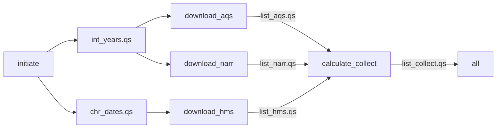

# beethoven-sm

Private development repository for transitioning NIEHS SET group's [`beethoven`](https://github.com/NIEHS/beethoven) air pollution modelling project from `targets` to Snakemake.

The current workflow prepares temporal specifications, downloads AQS, NARR, and HMS data via `amadeus`, and collects the returned download lists. Its default endpoint is `output/list_collect.qs`. Covariate calculation and model fitting are not yet implemented in the active workflow.

## Directory structure

```text
beethoven-sm/
├── Snakefile                       # Configuration, default target, rule includes
├── run.sh                          # Snakemake launcher with Apptainer enabled
├── config/
│   └── config.yaml                 # Date range, buffer radii, download directory
├── rules/
│   ├── a01_initiate.smk            # Date initialization
│   ├── b01_download.smk            # AQS, NARR, and HMS downloads
│   └── c01_calculate.smk           # Collection of download results
├── scripts/
│   ├── a01_initiate.R
│   ├── b01_aqs.R
│   ├── b02_narr.R
│   ├── b03_hms.R
│   └── c01_calculate.R
├── R/
│   ├── imports.R                  # Local split_dates() and fl_dates() functions
│   └── helpers.R                  # Interactive launch and SLURM utilities
├── container/
│   ├── def/                       # Covariates and models container definitions
│   ├── sh/                        # Apptainer build scripts
│   └── sif/                       # Built container images
├── input/                         # Raw downloads at the configured location
├── output/                        # Serialized R objects tracked by Snakemake
└── .snakemake/                    # Snakemake runtime state and logs
```

The `.smk` files declare dependencies, parameters, outputs, and containers. Their corresponding R scripts perform the work using the `snakemake` object. `R/imports.R` supplies temporary local implementations of date helpers; `R/helpers.R` is for interactive use and is not sourced by the workflow scripts. Downloaded inputs, generated outputs, container images, and `.snakemake/` are ignored by Git.

## Configuration

Edit `config/config.yaml` before running:

| Setting | Current value | Use |
| --- | --- | --- |
| `chr_daterange.start` | `"2021-12-01"` | First date in the inclusive date sequence. |
| `chr_daterange.end` | `"2022-01-31"` | Last date in the inclusive date sequence. |
| `int_radii` | `1000`, `5000`, `10000` | Buffer radii in meters, reserved for covariate calculations; unused by the current rules. |
| `chr_dir` | `"beethoven/beethoven-sm/input/"` | Download directory, resolved relative to `$HOME` by the download rules. An absolute path can also be supplied. |

With the current configuration, downloads go to `$HOME/beethoven/beethoven-sm/input/{aqs,narr,hms}/`. If the checkout is elsewhere, update `chr_dir` to the intended data location. Serialized outputs remain under `output/` relative to the workflow working directory. AQS and NARR receive the years covered by the date range; HMS receives its date endpoints.

## Pipeline



All `.qs` files shown in the DAG are under `output/` and are written and read with `qs2`.

| Rule | R script | Behavior and outputs |
| --- | --- | --- |
| `initiate` | `scripts/a01_initiate.R` | Expands the configured date range into `chr_dates.qs` and derives the included years in `int_years.qs`. Also writes `list_dates.qs` with chunks of up to 100 dates within each year, and `list_dates_julian.qs` with the same chunks in `YYYYJJJ` format. |
| `download_aqs` | `scripts/b01_aqs.R` | Downloads AQS CSV data for the included years into the `aqs/` download subdirectory and saves the returned list as `list_aqs.qs`. Retains downloaded ZIP files. |
| `download_narr` | `scripts/b02_narr.R` | Downloads NARR NetCDF data for the included years and the variables `air.sfc` and `weasd` into `narr/`. Saves the variable names as `chr_iter_narr.qs` and the returned list as `list_narr.qs`. |
| `download_hms` | `scripts/b03_hms.R` | Uses `fl_dates()` to pass the first and last configured dates to the HMS downloader. Downloads shapefiles into `hms/` and saves the returned list as `list_hms.qs`. Retains downloaded ZIP files. |
| `calculate_collect` | `scripts/c01_calculate.R` | Reads the three download lists and saves a named list with `aqs`, `narr`, and `hms` entries as `list_collect.qs`. This is a placeholder for later calculation stages. |
| `all` | None | Requests `output/list_collect.qs` as the default target. |

The three download rules can run independently after `initiate`, subject to the available cores. Each dataset is handled by one rule invocation for the whole configured period; there are no per-date or per-year wildcard jobs. `list_dates.qs`, `list_dates_julian.qs`, and `chr_iter_narr.qs` are generated but have no downstream consumers yet.

Snakemake tracks the declared `.qs` outputs. The individual raw files downloaded by `amadeus` are not declared rule outputs, so removing a raw file alone does not make its download rule out of date. All three download scripts pass `acknowledgement = TRUE` and `hash = FALSE` to `amadeus::download_data()`.

## Containers

Run the workflow from the `beethoven-sm` directory with Snakemake and Apptainer available on the host. Every active R rule uses `container/sif/container_covariates.sif`.

The covariates build definition uses `rocker/geospatial:latest`, installs `pak` and `qs2`, and installs `amadeus` from `NIEHS/amadeus@narr-hotfix-1005`. It disables user R profiles and environment files inside the container. The models definition and build script provide a separate GPU modelling environment, but no current rule uses that image.

If the covariates image needs to be built, run the following from `beethoven-sm`. The build script uses paths relative to `container/sh` and requires Apptainer fakeroot support and network access:

```bash
mkdir -p container/sif
(cd container/sh && bash build_container_covariates.sh)
```

## Run

Launch the default target with one core, or supply a core limit:

```bash
bash run.sh
bash run.sh 4
```

`run.sh` invokes `snakemake --cores <cores> --use-apptainer -p`. It accepts the core count as its first argument; use Snakemake directly for additional options. The launcher does not configure a cluster executor.

To inspect planned work without executing the R scripts or downloads:

```bash
snakemake --cores 4 --use-apptainer -n -p
```
