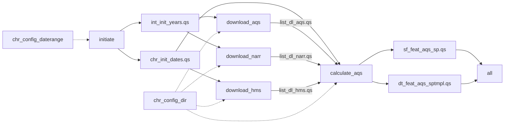

# beethoven-sm

Private development repository for transitioning NIEHS SET group's [`beethoven`](https://github.com/NIEHS/beethoven) air pollution modelling project from `targets` to Snakemake.

The current workflow prepares temporal specifications, downloads AQS, NARR, and HMS data via `amadeus`, and processes AQS feature locations and observations. Its default endpoints are `output/sf_feat_aqs_sp.qs` and `output/dt_feat_aqs_sptmpl.qs`. Model fitting is not yet implemented in the active workflow.

## Directory structure

```text
beethoven-sm/
├── Snakefile                       # Configuration, default target, rule includes
├── run.sh                          # Snakemake launcher with Apptainer enabled
├── config/
│   └── config.yaml                 # Date range, buffer radii, download directory
├── rules/
│   ├── a01_initiate.smk            # Date initialization
│   ├── b01_download.smk            # AQS, NARR, and HMS downloads
│   └── c01_calculate.smk           # AQS spatial and spatiotemporal features
├── scripts/
│   ├── a01_initiate.R
│   ├── b01_aqs.R
│   ├── b02_narr.R
│   ├── b03_hms.R
│   └── c01_aqs.R
├── R/
│   ├── beethoven.R                # Local split_dates() and fl_dates() functions
│   └── helpers.R                  # Interactive launch and SLURM utilities
├── container/
│   ├── def/                       # Covariates and models container definitions
│   ├── sh/                        # Apptainer build scripts
│   └── sif/                       # Built container images
├── input/                         # Raw downloads at the configured location
├── output/                        # Serialized R objects tracked by Snakemake
└── .snakemake/                    # Snakemake runtime state and logs
```

The `.smk` files declare dependencies, parameters, outputs, and containers. Their corresponding R scripts perform the work using the `snakemake` object. `R/beethoven.R` supplies temporary local implementations of date helpers; `R/helpers.R` is for interactive use and is not sourced by the workflow scripts. Downloaded inputs, generated outputs, container images, and `.snakemake/` are ignored by Git.

## Names

Use lowercase, underscore-separated object names in the order `objecttype_stage_source_description`. Each component identifies the object's type, stage or configuration role, data source, and contents. Shared configuration and initialization objects omit the dataset source; download lists omit the additional description. For serialized objects, keep the R object name, named Snakemake input/output, and saved filename stem identical; for example, `sf_feat_aqs_sp` is saved as `output/sf_feat_aqs_sp.qs`.

| Component | Meaning | Codes used in the pipeline |
| --- | --- | --- |
| `objecttype` | Object type, class, or configured value type. | `sf`: spatial simple features; `dt`: `data.table`; `list`: list; `chr`: character values; `int`: integer values. |
| `stage` | Processing stage or configuration role. | `config`: configured values; `init`: derived initialization objects; `dl`: download results; `feat`: processed feature data; `iter`: variable selection, as in `chr_iter_narr`. |
| `source` | Dataset from which the object is derived. Not included for shared configuration or initialization objects. | `aqs`, `narr`, `hms`. |
| `description` | Contents or spatial/temporal scope. Not included for download list objects. | `daterange`: configured date endpoints; `dir`: data directory; `radii`: buffer radii; `dates`: calendar dates; `years`: included years; `datesj`: Julian-format dates (`YYYYJJJ`); `sp`: spatial only; `sptmpl`: spatiotemporal. |

Configuration names follow `objecttype_config_description` and are defined in `config/config.yaml`. Initialization outputs follow `objecttype_init_description` and are derived by `initiate`. For example, `chr_config_daterange` supplies the start and end dates used to generate `chr_init_dates`; the configuration value is not itself a `.qs` output.

Examples from the current pipeline:

| Object | Interpretation |
| --- | --- |
| `sf_feat_aqs_sp` | An `sf` object containing unique AQS feature locations for the configured period: site identifiers and spatial coordinates, without monitored PM2.5 values. |
| `dt_feat_aqs_sptmpl` | A `data.table` containing AQS feature locations and times with available PM2.5 observations. The script requests `Arithmetic.Mean` and `Event.Type` from the daily `88101` CSV files. |
| `chr_config_daterange` | Configuration mapping with character `start` and `end` dates. |
| `chr_config_dir` | Configured download directory, resolved by the rules and passed to the R scripts under the same parameter name. |
| `int_config_radii` | Configured buffer radii in meters, reserved for later covariate calculations. |
| `chr_init_dates` | Character vector of all calendar dates in the configured period. |
| `int_init_years` | Years covered by the configured period, used by the AQS and NARR download rules. |
| `list_init_dates` | List of chunks of up to 100 calendar dates, with each chunk contained within one year. |
| `list_init_datesj` | The same date chunks in Julian format (`YYYYJJJ`); the `j` suffix identifies this representation. |

The current download lists use `objecttype_stage_source`: `list_dl_aqs`, `list_dl_narr`, and `list_dl_hms`. The NARR variable selection uses the same three-part form, `chr_iter_narr`. `list_dl_collect` is a local list combining the three download results in `scripts/c01_aqs.R`; it is not saved as a pipeline output. The AQS feature outputs demonstrate the complete four-part convention.

## Configuration

Edit `config/config.yaml` before running:

| Setting | Current value | Use |
| --- | --- | --- |
| `chr_config_daterange.start` | `"2021-12-01"` | First date in the inclusive date sequence. |
| `chr_config_daterange.end` | `"2022-01-31"` | Last date in the inclusive date sequence. |
| `int_config_radii` | `1000`, `5000`, `10000` | Buffer radii in meters, reserved for covariate calculations; unused by the current rules. |
| `chr_config_dir` | `"beethoven/beethoven-sm/input/"` | Data directory, resolved relative to `$HOME` by the download and AQS calculation rules. An absolute path can also be supplied. |

With the current configuration, downloads go to `$HOME/beethoven/beethoven-sm/input/{aqs,narr,hms}/`. If the checkout is elsewhere, update `chr_config_dir` to the intended data location. Serialized outputs remain under `output/` relative to the workflow working directory. AQS and NARR receive `int_init_years`; HMS and AQS feature processing receive the endpoints of `chr_init_dates`. The initialization rule passes `chr_config_daterange.start` and `.end` to its script as the parameters `start` and `end`.

## Pipeline



Solid arrows show file dependencies; dotted arrows show configuration parameters. All `.qs` files shown in the DAG are under `output/` and are written and read with `qs2`. `int_config_radii` is not shown because no current rule uses it.

| Tier | Rule | R script | Behavior and outputs |
| --- | --- | --- | --- |
| initiate | `initiate` | `scripts/a01_initiate.R` | Uses `chr_config_daterange` to generate `chr_init_dates.qs` for the configured date sequence and `int_init_years.qs` for the included years. Also writes `list_init_dates.qs` for chunks of up to 100 dates within each year, and `list_init_datesj.qs` for the same chunks in `YYYYJJJ` format. |
| download | `download_aqs` | `scripts/b01_aqs.R` | Downloads AQS CSV data for the included years into the `aqs/` download subdirectory and saves the returned list as `list_dl_aqs.qs`. Retains downloaded ZIP files. |
| download | `download_narr` | `scripts/b02_narr.R` | Downloads NARR NetCDF data for the included years and the variables `air.sfc` and `weasd` into `narr/`. Saves the variable names as `chr_iter_narr.qs` and the returned list as `list_dl_narr.qs`. |
| download | `download_hms` | `scripts/b03_hms.R` | Uses `fl_dates()` to pass the first and last configured dates to the HMS downloader. Downloads shapefiles into `hms/` and saves the returned list as `list_dl_hms.qs`. Retains downloaded ZIP files. |
| calculate | `calculate_aqs` | `scripts/c01_aqs.R` | Reads `chr_init_dates.qs` and all three download lists. Uses `amadeus::process_aqs()` in `location` mode to save spatial locations as `sf_feat_aqs_sp.qs`, and in `available-data` mode to save PM2.5 observations by location and time as `dt_feat_aqs_sptmpl.qs`. |
| — | `all` | None | Requests both `output/sf_feat_aqs_sp.qs` and `output/dt_feat_aqs_sptmpl.qs` as the default targets. |

The tier identifies the rule's processing stage. `all` selects the workflow endpoints and has no processing tier. No `model` or `predict` rules are defined yet.

The three download rules can run independently after `initiate`, subject to the available cores. Each dataset is handled by one rule invocation for the whole configured period; there are no per-date or per-year wildcard jobs. `list_init_dates.qs`, `list_init_datesj.qs`, and `chr_iter_narr.qs` are declared outputs but have no downstream consumers yet.

`calculate_aqs` depends on all three download lists and combines them locally as `list_dl_collect`. Its feature processing currently reads only the AQS files under the configured `aqs/data_files/` directory; NARR and HMS are prerequisites but are not yet used to calculate feature values.

Snakemake tracks the declared `.qs` outputs. The individual raw files downloaded by `amadeus` are not declared rule outputs, so removing a raw file alone does not make its download rule out of date. All three download scripts pass `acknowledgement = TRUE` and `hash = FALSE` to `amadeus::download_data()`.

## Containers

Run the workflow from the `beethoven-sm` directory with Snakemake and Apptainer available on the host. Every active R rule uses `container/sif/container_covariates.sif`.

The covariates build definition uses `rocker/geospatial:latest`, installs `pak` and `qs2`, and installs `amadeus` from `NIEHS/amadeus@narr-hotfix-1005`. It disables user R profiles and environment files inside the container. The models definition and build script provide a separate GPU modelling environment, but no current rule uses that image.

If the covariates image needs to be built, run the following from `beethoven-sm`. The build script uses paths relative to `container/sh` and requires Apptainer fakeroot support and network access:

```bash
mkdir -p container/sif
(cd container/sh && bash build_container_covariates.sh)
```

## Run

Launch the default target with one core, or supply a core limit:

```bash
bash run.sh
bash run.sh 4
```

`run.sh` invokes `snakemake --cores <cores> --use-apptainer -p`. It accepts the core count as its first argument; use Snakemake directly for additional options. The launcher does not configure a cluster executor.

To inspect planned work without executing the R scripts or downloads:

```bash
snakemake --cores 4 --use-apptainer -n -p
```
